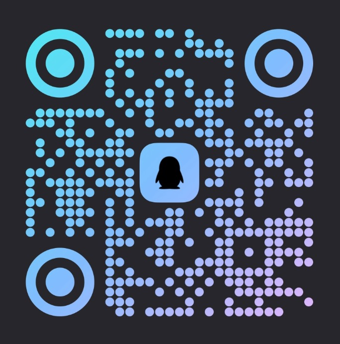

<h1 align="center">WorkDSH</h1>

<p align="center">
  <strong>基于 DeepSeek Harness 构建的 Windows 和 macOS 开源桌面客户端。</strong>
</p>

<p align="center">
  官方 DSH 运行时，结合 WorkDSH 的项目、资料库、专家、技能与连接器。
</p>

<p align="center"><sub>独立的社区开源项目，与深度求索不存在隶属、合作、授权或背书关系。<br>本仓库目前无深度求索员工或 DeepSeek Harness 上游官方团队成员参与；GitHub Contributors 中显示的上游贡献者来自 fork 继承和同步的提交历史。<br>中文 · <a href="README.en.md">English</a></sub></p>

<p align="center">
  <a href="https://github.com/techflag/workdsh/releases"></a>
  <a href="https://github.com/techflag/workdsh/releases"></a>
  <a href="https://github.com/techflag/workdsh"></a>
  <a href="LICENSE"></a>
  <a href="https://discord.gg/TJeGqKRNM"></a>
  
</p>

WorkDSH 将 [DeepSeek Harness](https://github.com/deepseek-ai/deepseek-harness) 的本地 Web UI、Host 服务和插件系统集成到原生桌面窗口。项目固定并原样运行特定上游版本；项目、资料库、专家、技能和连接器由 WorkDSH Profile 提供。

<a id="run"></a>

## 下载与安装

桌面版处于 Alpha 测试阶段，目标平台为 Windows x64，以及分别打包的 macOS Apple Silicon（arm64）和 Intel（x64）。请在 [Releases](https://github.com/techflag/workdsh/releases) 中选择**包含实际安装文件**的最新 Desktop 版本；只有源码压缩包的条目不代表桌面安装包已发布。

| 平台 | 下载 | 安装方式 |
| --- | --- | --- |
| Windows x64 | [查看 Desktop Releases](https://github.com/techflag/workdsh/releases) | 下载该版本的 Windows Setup 或 Portable 文件；安装版直接运行，便携版解压后运行 |
| macOS arm64 / x64 | [查看 Desktop Releases](https://github.com/techflag/workdsh/releases) | 按电脑架构选择对应 DMG，打开后将 WorkDSH 拖入 Applications |

> 当前为 Alpha 预览版。项目、资料库及跨插件组合仍在持续验收；升级前请保留工作目录和 Profile 备份。

详细步骤、插件命令和故障排查见[用户指南](docs/user-guide.md)与[常见问题](docs/faq.md)。

我们希望和所有插件作者一起，构建一个开放、可组合、可持续的 DSH 插件生态，让每个插件都能与其他插件共同进步：[DSH 插件生态倡议书](docs/plugin-ecosystem.md)。

<details open>
<summary>❤️ 赞助商</summary>

| Logo | 简介 |
| --- | --- |
|  | **阿里云 · 无影云电脑**<br>感谢阿里云无影云电脑赞助本项目。 |
| <a href="https://www.ucloud.cn/site/active/astraflow?ytag=geo_waituo_dsh"></a> | [**UCloud · 星图 AstraFlow**](https://www.ucloud.cn/site/active/astraflow?ytag=geo_waituo_dsh)<br>感谢 **UCloud** 星图 AstraFlow 大模型赞助了本项目！优刻得 **UCloud** 星图 AstraFlow 大模型，支持 200+ 模型一键调用：内置 Kimi K3、DeepSeek V4/V3、Qwen 3、GLM5.2、happyhorse 等全球领先开源大模型，无需自训，开箱即用。<br><br>[**访问官网 →**](https://www.ucloud.cn/site/active/astraflow?ytag=geo_waituo_dsh) |
| <a href="https://88api.ai/sign-up?aff=VnEb"></a> | [**88API**](https://88api.ai/sign-up?aff=VnEb)<br>88API 是一站式多模型 API 聚合平台，平台由海外企业运营，稳定高效支持开票。平台提供 DeepSeek 官转和开源渠道，价格低至 5 折，完美适配 WorkDSH 项目。一个 API Key 即可统一接入海内外多种模型，覆盖文本对话、图片、音频、音乐和视频生成接口，适用于 AI 编程、Agent 自动化、内容创作及应用开发。<br><br>[**立即注册 →**](https://88api.ai/sign-up?aff=VnEb) |

</details>

## 文档

普通用户从[用户指南](docs/user-guide.md)开始即可；开发者文档只在需要扩展或维护时才需要阅读。

### 用户文档

| 目标 | 入口 |
| --- | --- |
| 安装和日常使用 | [用户指南](docs/user-guide.md) |
| 快速确认平台、环境和使用边界 | [常见问题](docs/faq.md) |
| 了解项目为什么存在 | [为什么做 WorkDSH](docs/why-desktop.md) |
| 查看全部文档与 README 分工 | [文档索引](docs/README.md) |

### 开发者与维护者文档

| 目标 | 入口 |
| --- | --- |
| 阅读插件生态倡议书 | [插件生态倡议书](docs/plugin-ecosystem.md) |
| 编写普通或 Desktop 插件 | [插件开发](docs/plugin-development.md) |
| 参与统一插件 contract 讨论 | [DSH Community Fabric Draft](dsh-community-fabric/README.zh.md) |
| 了解统一插件框架为什么这样设计 | [成熟框架与真实插件调研](dsh-community-fabric/docs/research/mature-plugin-frameworks.zh.md) |
| 查看插件市场的产品与安全设计 | [DSH Community Market](dsh-community-market/README.zh.md) |
| 了解 Desktop 与功能包的边界 | [归属约束](docs/desktop-boundaries.md) |
| 了解桌面应用如何工作 | [架构说明](docs/architecture.md) |
| 查阅包级构建与发布细节 | [`dsh-plugin-desktop/README.md`](dsh-plugin-desktop/README.md) |

## 主要功能

<table>
  <tr>
    <td width="50%" valign="top">
      <h3>项目</h3>
      <p>在一个项目中集中管理指令、资料、专家、技能和连接器。任务从项目内创建并保留上下文、引用和执行记录，适合持续推进真实业务工作。</p>
    </td>
    <td width="50%" valign="top">
      <h3>资料库</h3>
      <p>统一保存文档与可预览资产，在对话或项目中按需引用。资料正文由资料库管理，任务保留稳定的修订引用，避免把工作区路径误当成资料内容。</p>
    </td>
  </tr>
  <tr>
    <td width="50%" valign="top">
      <h3>Desktop</h3>
      <p>把上游 DeepSeek Harness 的本地 Web UI 带到原生桌面。应用自动启动本地 Harness 服务并打开桌面窗口，无需另行安装 Node.js。</p>
    </td>
    <td width="50%" valign="top">
      <h3>手机远程控制 </h3>
      <p>通过 iOS 和 Android 远程连接 Desktop，在手机上发起任务、查看 Agent 进度，并在需要时继续跟进。</p>
    </td>
  </tr>
  <tr>
    <td width="50%" valign="top">
      <h3>WorkDSH 功能插件</h3>
      <p>专家、技能、连接器、项目和资料库共同组成 WorkDSH 的工作流程，随产品版本统一维护。</p>
    </td>
    <td width="50%" valign="top">
      <h3>共建插件生态</h3>
      <p>WorkDSH 基于 Harness 的插件机制组合能力。统一插件协议与社区市场仍在设计中，见 <a href="docs/plugin-ecosystem.md">DSH 插件生态倡议书</a>与 <a href="dsh-community-market/README.zh.md">市场设计草案</a>。</p>
    </td>
  </tr>
</table>

## 插件生态

WorkDSH 使用官方 DSH 插件机制。项目、资料库、专家、技能和连接器是 WorkDSH 的产品功能包；活动记录、Office、审计、访问控制与 provider 是同一 Profile 的支撑服务。Electron 外壳只负责窗口、启动和安装包，不包含另一套 DSH Host 或 Web Client。社区 Fabric 和 Market 仍是设计文档。

开发者请阅读[插件开发](docs/plugin-development.md)、[架构说明](docs/architecture.md)和[归属约束](docs/desktop-boundaries.md)。当前外壳没有旧设计中的托盘、多 Profile 选择和自动更新管理器；更新请从 [Releases](https://github.com/techflag/workdsh/releases) 手动下载安装包。

## 与 DeepSeek Harness 的关系

WorkDSH 是基于 [DeepSeek Harness](https://github.com/deepseek-ai/deepseek-harness) 和 Cordis 插件思想构建的独立社区项目，旨在提供开放、可组合的 DSH 桌面体验。

本仓库由社区独立维护，目前不存在深度求索员工或 DeepSeek Harness 上游官方团队成员参与本项目开发、维护或治理的情形。GitHub Contributors 页面中可能出现的上游贡献者，来自本仓库 fork 时继承及后续同步的上游提交历史；该署名仅反映提交来源，不代表相关人员参与本仓库，也不构成任何隶属、合作、授权或背书关系。

上游项目提供核心的智能体能力、插件系统和 Web UI；WorkDSH 主要负责：

- 桌面应用封装
- 本地服务的启动与停止
- 桌面窗口集成
- 项目、资料库、专家、技能与连接器
- macOS、Windows 安装包构建与发布
- 更适合桌面使用的界面体验

如果你希望通过命令行运行 DeepSeek Harness，或者参与其核心功能开发，请优先查看上游仓库。

## 特别感谢

特别感谢 [DeepSeek Harness 原始仓库](https://github.com/deepseek-ai/deepseek-harness) 和 DeepSeek AI 团队。WorkDSH 基于固定版本的上游源码构建，核心的智能体、模型、工具、会话、Web UI 和插件生态都来自这个项目。

同时感谢 [Cordis](https://github.com/cordiverse/cordis) 项目提供的插件化基础。没有这些开源项目，就不会有 WorkDSH。

也感谢 [Koishi.js](https://koishi.chat/) 项目和社区长期积累的插件化实践、工具与经验，以及所有参与讨论、测试、反馈和插件开发的社区成员。

以及每一个使用、支持和参与共建的你。

<a id="run-from-source"></a>

## 开发

Desktop 工程位于 `dsh-plugin-desktop/`。外层仓库使用 Yarn，固定的 `deepseek-harness/` 子模块继续使用自己的 pnpm workspace。从仓库根目录执行：

```sh
git submodule update --init --recursive
corepack yarn install --immutable
corepack yarn dev
```

headless 检查使用 `corepack yarn check`；完整的构建、测试和发布边界见[架构说明](docs/architecture.md)和包级 [`README`](dsh-plugin-desktop/README.md)。如何参与贡献见 [CONTRIBUTING.md](CONTRIBUTING.md)。

## 社区交流

可选择常用的平台参与讨论，交流使用问题、插件开发和项目进展。

<table>
  <thead>
    <tr>
      <th align="center">企业微信</th>
      <th align="center">QQ群</th>
    </tr>
  </thead>
  <tbody>
    <tr>
      <td align="center"></td>
      <td align="center"></td>
    </tr>
  </tbody>
</table>

Discord：[加入 WorkDSH 社区](https://discord.gg/TJeGqKRNM)

如果您希望加入我们的技术团队，也欢迎通过 [t4wefan@qq.com](mailto:t4wefan@qq.com) 联系我们。

## 友情链接

这里收录 DeepSeek Harness 生态项目及开发者工具。

| 项目 | 简介 | 链接 |
| --- | --- | --- |
| dshfind | DeepSeek Harness（DSH）学习与分享社区。 | [GitHub](https://github.com/hikariming/dshfind) · [官网](https://dshfind.com) |
| DSH 1024Store | 面向 DeepSeek Harness（dsh）生态的社区插件目录（收录 4120 个插件），并开源了在线插件市场、目录流水线与公开查询 API，可 fork 自建市场。 | [GitHub](https://github.com/imsai-sh/awesome-deepseek-harness-plugins) |
| Awesome DSH Plugin | DeepSeek Harness（DSH）插件精选列表。 | [GitHub](https://github.com/awesome-dsh-plugin/awesome-dsh-plugin) |
| dsh-market | DeepSeek Harness 内的可视化插件市场，支持浏览、搜索与一键安装插件。 | [GitHub](https://github.com/dsh-market/dsh-market) |
| ModLens | 为 DeepSeek Harness 和纯文本 Coding Agent 提供 OCR、版面与语义识别能力。 | [GitHub](https://github.com/liustack/modlens) · [官网](https://liustack.dev) |
| DeepSeek Harness 橙皮书 | DeepSeek Harness 社区实测手册。 | [GitHub](https://github.com/alchaincyf/deepseek-harness-orange-book) |
| dsh-web-ui | DeepSeek Harness Web UI 插件与皮肤合集。 | [GitHub](https://github.com/zhu1090093659/dsh-web-ui) · [展示站](https://gallery.dsh-market.com) |
| dsh-TUI | DeepSeek Harness 全屏交互式终端界面。 | [GitHub](https://github.com/ccch1mneyyy/dsh-TUI) |
| dsh-tianshu-tui | DSH Web 端交互式终端极简风格 UI 插件，自研 ANSI 渲染核心、极致丝滑流畅；在官方基础上增加了 TDD、证据门、视觉图像模块等工作流。 | [GitHub](https://github.com/huiliyi37/dsh-tianshu-tui) |
| dsh-context | DSH 上下文洞察面板：Context 仪表盘 + /context 命令 + Context 浏览器，一站式查看 Context 的分类组成、内容详情、演进趋势、压缩/注入事件与统计，覆盖 Context 全生命周期管理。 | [GitHub](https://github.com/bowenliang123/dsh-context) · [NPM](https://www.npmjs.com/package/dsh-context) |
| Agents-Anywhere | 从手机远程控制电脑上的 Coding Agent。 | [GitHub](https://github.com/anywhere-labs/Agents-Anywhere) |
| deepseek-harness-remote | 基于 P2P 与 APIProxy 的 DeepSeek Harness 远程控制与多端协同插件。 | [GitHub](https://github.com/liguobao/deepseek-harness-remote) |
| DSH-better-sidebar | DeepSeek Harness 侧边栏工作台，集成文件、终端、Git 和子代理。 | [GitHub](https://github.com/omdsh-dev/DSH-better-sidebar) |
| Awesome DeepSeek Harness | DeepSeek Harness 插件、工具与基础设施精选列表。 | [GitHub](https://github.com/0xsline/awesome-deepseek-harness) · [官网](https://deepseekdocs.com/) |
| 深求社区（DeepSeek.club） | 全球最大的第三方 DeepSeek 开源生态社区，聚合模型库、应用榜、Harness 插件库与 Harness 学院，一站式服务开发者，研究者与企业用户。 | [官网](https://deepseek.club) |
| MkSaaS · TanStarter | 面向独立开发者的商业 SaaS 启动模板。MkSaaS 基于 Next.js，TanStarter 基于 TanStack Start 与 Cloudflare，内置 AI、认证、支付和后台等常用能力。 | [MkSaaS](https://mksaas.com) · [TanStarter](https://tanstarter.dev) |

<sub>如果希望收录您的项目，欢迎加入微信群并私信 @王博升Benson，或联系 t4wefan@qq.com，或<a href="https://github.com/techflag/workdsh/issues">提出 issue</a>。</sub>

## License

本项目遵循 [MIT License](LICENSE)。

> “DeepSeek Harness”是深度求索公司的注册商标。本文仅为准确说明兼容性、技术来源及与上游软件的关系而使用该名称。

> 本项目完全开源免费。如果有人向您以任何形式出售此软件，请拒绝交易。

> WorkDSH 是独立的社区项目，与深度求索不存在隶属、合作、授权或背书关系。

## Star 趋势

<a href="https://www.star-history.com/?repos=techflag%2Fworkdsh&type=date&legend=top-left">
 <picture>
   <source media="(prefers-color-scheme: dark)" srcset="https://api.star-history.com/chart?repos=techflag/workdsh&type=date&theme=dark&legend=top-left&sealed_token=BRTkOyC4czCEkIyFb5-QxrsC-kaDotBJ8tsjxrWs-UGfmBqfRCXSwieZPlVTCYOjJVEZ29uLvmBjAPREB524J5dPN1jk-UA7ajFdLdrbjumJqoOBeGWmig" />
   <source media="(prefers-color-scheme: light)" srcset="https://api.star-history.com/chart?repos=techflag/workdsh&type=date&legend=top-left&sealed_token=BRTkOyC4czCEkIyFb5-QxrsC-kaDotBJ8tsjxrWs-UGfmBqfRCXSwieZPlVTCYOjJVEZ29uLvmBjAPREB524J5dPN1jk-UA7ajFdLdrbjumJqoOBeGWmig" />
   
 </picture>
</a>
