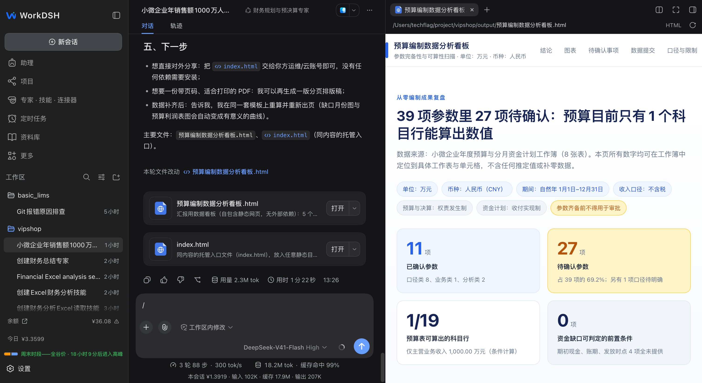

<p align="center"></p>
<h1 align="center">WorkDSH</h1>
<p align="center"><strong>A WorkBuddy-style workspace with the DSH plugin ecosystem.</strong></p>
<p align="center">Inspired by WorkBuddy, WorkDSH brings projects, material, experts, skills, and connectors to the desktop—and extends them through DeepSeek Harness plugins.</p>
<p align="center"><a href="#download-desktop">Download Desktop</a> · <a href="#from-material-to-deliverable">Explore the workflow</a> · <a href="docs/user-guide.en.md">User guide</a> · <a href="README.zh-CN.md">简体中文</a></p>

[](https://github.com/techflag/workdsh/releases/tag/desktop-v2.0.5-alpha.21) [](https://github.com/techflag/workdsh) [](LICENSE)


<sub>Captured from a local WorkDSH session. Project names and account figures are demonstration data, not bundled with the installer.</sub>

## A WorkBuddy-style experience, an open DSH ecosystem

WorkDSH takes WorkBuddy's way of organizing work as its model. It recreates the core path from projects and document references to expert and skill collaboration, while retaining DeepSeek Harness models, tools, and sessions so the desktop workspace can grow through DSH plugins.

| What you need to do | Where WorkDSH helps |
| --- | --- |
| Keep working toward a long-term goal | **Projects** bring instructions, plans, tasks, material, and capability settings together. |
| Give AI the files you already have | The **library** manages local files, search, and previews; tasks can reference material and its revision. |
| Reuse a team's working methods | **Experts** save role and capability settings; **skills** carry callable instructions and resources. |
| Keep the result beyond the chat | The **deliverable workspace** previews or edits supported working copies of documents, spreadsheets, presentations, HTML, and PDF. |

### From material to deliverable

```text
File in library ──reference──> Project task ──choose──> Expert / Skill / Connector
                                            │
                                            └──> Inspect the process and result; keep editing in supported editors
```

This path is WorkDSH's product direction. End-to-end validation of project document references, expert execution, and different Office formats is ongoing during Alpha. Preview, editing, and export fidelity differ by format; the [current capabilities and limits](workdsh-web/README.md) describe them in more detail.

<details>
<summary>See an HTML deliverable from a real local conversation</summary>



<sub>A local task example showing deliverable cards and right-side preview; it does not imply lossless editing for every file.</sub>

</details>

## WorkBuddy-style Skills meet DSH plugins

This is the other half of WorkDSH: **the workflow draws on WorkBuddy; extensions use DSH**. These ecosystems serve different purposes:

| | WorkBuddy-style Skill | DSH plugin |
| --- | --- | --- |
| What it adds | Reusable instructions, scripts, references, and resources | New tools, services, and workspace capabilities |
| How it works | Import a file or ZIP containing `SKILL.md`, review it, then confirm installation | Load and compose plugins against the current DSH version |
| In WorkDSH | Search, enable, and manage a local skill directory; migrate WorkBuddy-style and community Skills | Projects, library, experts, skills, and connectors are themselves extensions; third-party plugins can be adapted |

WorkBuddy-style Skills come from a broad ecosystem. WorkDSH offers a compatible import path, **not a claim that every Skill is tested or preinstalled**. Skills with scripts, external services, or special dependencies need individual testing; third-party DSH plugins need version-specific validation too. [Skill management](workdsh-web/packages/plugins/skills/README.md) · [Plugin development](docs/plugin-development.en.md) · [Ecosystem manifesto](docs/plugin-ecosystem.en.md)


<sub>The installable entries shown here come from the demonstration machine's local skill directory. They are neither bundled with the installer nor an officially hosted online marketplace.</sub>

## Download Desktop

The current public desktop installer release is **2.0.5-alpha.21**. These links point directly to files in its [GitHub Release](https://github.com/techflag/workdsh/releases/tag/desktop-v2.0.5-alpha.21):

| Platform | Download |
| --- | --- |
| Windows x64 | [WorkDSH Setup.exe](https://github.com/techflag/workdsh/releases/download/desktop-v2.0.5-alpha.21/dsh-plugin-desktop-windows-x64--WorkDSH-2.0.5-x64-Setup.exe) |
| macOS Apple Silicon | [WorkDSH arm64.dmg](https://github.com/techflag/workdsh/releases/download/desktop-v2.0.5-alpha.21/dsh-plugin-desktop-macos-arm64--WorkDSH-2.0.5-arm64.dmg) |
| macOS Intel | [WorkDSH x64.dmg](https://github.com/techflag/workdsh/releases/download/desktop-v2.0.5-alpha.21/dsh-plugin-desktop-macos-x64--WorkDSH-2.0.5-x64.dmg) |

Desktop installers include Node.js and Python runtimes by default, so users do not need to install them separately. This is an **Alpha release**: end-to-end project document references, expert execution, and different Office formats are still being validated. The macOS DMGs are unsigned; download updates from [Releases](https://github.com/techflag/workdsh/releases). Start with the [user guide](docs/user-guide.en.md) and [FAQ](docs/faq.en.md).

## Development and documentation

Source ownership: [WorkDSH feature packages and Web](workdsh-web/README.md) · [Desktop carrier](dsh-plugin-desktop/README.md) · [Architecture](docs/architecture.en.md) · [All documentation](docs/README.en.md). Running from source requires Node.js 22.19+ or 24+, Corepack, and Yarn 4.18.0:

```sh
git submodule update --init --recursive
corepack yarn install --immutable
corepack yarn dev
```

Run checks with `corepack yarn check`. [Contributing](CONTRIBUTING.en.md)

## Community and acknowledgements

WorkDSH builds on the open-source [DeepSeek Harness](https://github.com/deepseek-ai/deepseek-harness) project. Feedback and contributions: [GitHub Issues](https://github.com/techflag/workdsh/issues) · [Contributing](CONTRIBUTING.en.md)

WorkDSH uses the [MIT License](LICENSE). It is an independent community project and is not affiliated with, partnered with, authorized by, or endorsed by DeepSeek or WorkBuddy. Those names appear only to describe technical origins, compatibility, and design references. Upstream contributors shown on GitHub are inherited from synchronized commit history; this does not imply that they maintain this repository.

## Star history

[](https://www.star-history.com/?repos=techflag%2Fworkdsh&type=date)
