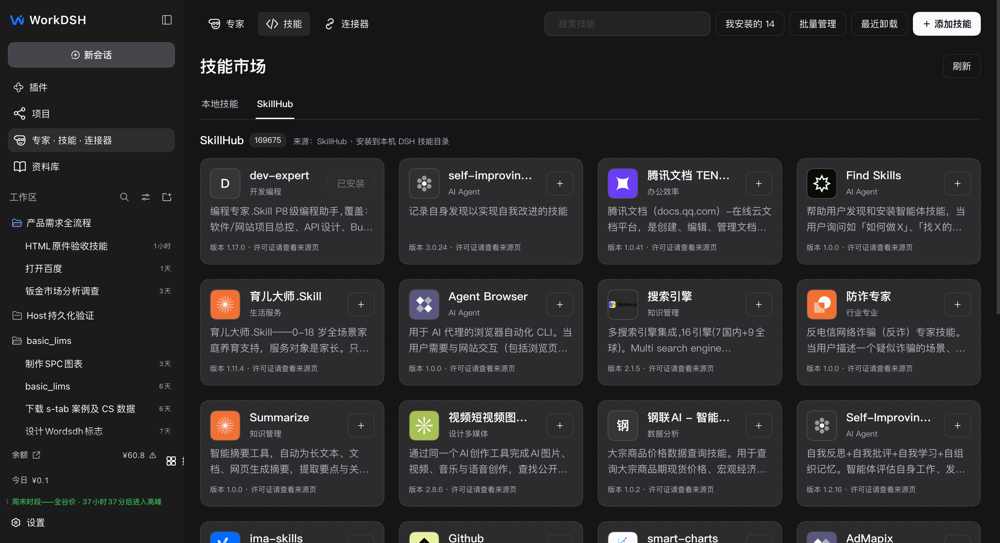
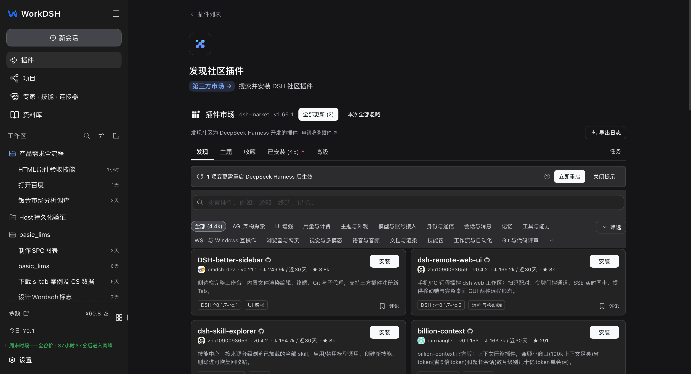

<p align="center"></p>
<h1 align="center">WorkDSH</h1>
<p align="center"><strong>A WorkBuddy-style workspace where skills, experts, and plugins shape new workflows.</strong></p>
<p align="center">WorkDSH brings material, experts, skills, and connectors into one workspace, with the SkillHub catalog and installable DSH community plugins.</p>
<p align="center"><a href="#download-desktop">Download Desktop</a> · <a href="#from-material-to-deliverable">Explore the workflow</a> · <a href="docs/user-guide.en.md">User guide</a> · <a href="README.zh-CN.md">简体中文</a></p>

[](https://github.com/techflag/workdsh/releases/tag/desktop-v2.0.6-alpha.1) [](https://github.com/techflag/workdsh) [](LICENSE)


<sub>Captured from a local WorkDSH session. Project names and account figures are demonstration data, not bundled with the installer.</sub>

## A WorkBuddy-style experience, an open DSH ecosystem

WorkDSH draws on WorkBuddy's way of organizing projects, material, experts, skills, and connectors, and implements those pages and management features on DeepSeek Harness. DSH is a complete agent application in its own right; it composes models, tools, skill support, and UI through plugins. WorkDSH adds its workspace features through the same mechanism.

| What you need to do | Where WorkDSH helps |
| --- | --- |
| Keep working toward a long-term goal | **Projects** bring instructions, plans, tasks, material, and capability settings together. |
| Give AI the files you already have | The **library** manages local files, search, and previews; tasks can reference material and its revision. |
| Reuse a team's working methods | **Experts** save role and capability settings; **skills** carry callable instructions and resources. |
| Keep the result beyond the chat | The **deliverable workspace** previews or edits supported working copies of documents, spreadsheets, presentations, HTML, and PDF. |

### From material to deliverable

```text
File in library ──reference──> Project task ──choose──> Expert / Skill / Connector
                                            │
                                            └──> Inspect the process and result; keep editing in supported editors
```

This path is WorkDSH's product direction. End-to-end validation of project document references, expert execution, and different Office formats is ongoing during Alpha. Preview, editing, and export fidelity differ by format; the [current capabilities and limits](workdsh-web/README.md) describe them in more detail.

<details>
<summary>See an HTML deliverable from a real local conversation</summary>


<sub>A local task example showing deliverable cards and right-side preview; it does not imply lossless editing for every file.</sub>

</details>

## Skills and plugins

It helps to distinguish **the content people use** from **the software extension that manages it**. A skill usually consists of instructions and resources containing `SKILL.md`; it can be installed directly into the local DSH Skills directory and is not necessarily a plugin. WorkDSH's skill manager is a DSH plugin. An expert configuration is not itself a plugin either; a WorkDSH plugin manages experts. Other DSH plugins can add tools or UI features directly. The plugin system can therefore support skills, experts, and software functions without making every skill or expert a separate plugin.

DSH plugins can be individual tools or combine UI, services, and other resources into a larger application scenario. For example, a data-management plugin could add data views and processing tools, then work with skills and experts across a workflow. This illustrates what the plugin model can support; it does not mean this release bundles such a data-management system. Users can discover and install skills through SkillHub and find DSH community plugins through dsh-market. Before installing a plugin, check what it provides and whether it supports the current DSH version.

WorkDSH connects two independently maintained catalogs: [SkillHub](https://skillhub.cn/) for Skills and [dsh-market](https://dshmarket.com/zh/) for DSH plugins. SkillHub entries show their source and version, and open the source page for license information before installation. The DSH catalog is provided by the third-party dsh-market plugin inside the existing plugin page. Catalog entries are **not all preinstalled, reviewed, or endorsed by WorkDSH**; check each item's license, dependencies, and DSH compatibility. [Skill management](workdsh-web/packages/plugins/skills/README.md) · [Plugin development](docs/plugin-development.en.md) · [Ecosystem manifesto](docs/plugin-ecosystem.en.md)



<sub>Live SkillHub results; catalog size and entries change over time. The local session shown is a demonstration environment.</sub>



<sub>The third-party dsh-market plugin supplies discovery and installation. The screenshot does not imply that catalog plugins are bundled with WorkDSH.</sub>

## Download Desktop

The planned desktop installer release is **2.0.6-alpha.1**. Its download links will become available after the [GitHub Release](https://github.com/techflag/workdsh/releases/tag/desktop-v2.0.6-alpha.1) is published:

| Platform | Download |
| --- | --- |
| Windows x64 | [WorkDSH Setup.exe](https://github.com/techflag/workdsh/releases/download/desktop-v2.0.6-alpha.1/dsh-plugin-desktop-windows-x64--WorkDSH-2.0.6-alpha.1-x64-Setup.exe) |
| macOS Apple Silicon | [WorkDSH arm64.dmg](https://github.com/techflag/workdsh/releases/download/desktop-v2.0.6-alpha.1/dsh-plugin-desktop-macos-arm64--WorkDSH-2.0.6-alpha.1-arm64.dmg) |
| macOS Intel | [WorkDSH x64.dmg](https://github.com/techflag/workdsh/releases/download/desktop-v2.0.6-alpha.1/dsh-plugin-desktop-macos-x64--WorkDSH-2.0.6-alpha.1-x64.dmg) |

Desktop installers include Node.js and Python runtimes by default, so users do not need to install them separately. This is an **Alpha release**: end-to-end project document references, expert execution, and different Office formats are still being validated. The macOS DMGs are unsigned; download updates from [Releases](https://github.com/techflag/workdsh/releases). Start with the [user guide](docs/user-guide.en.md) and [FAQ](docs/faq.en.md).

## Development and documentation

Source ownership: [WorkDSH feature packages and Web](workdsh-web/README.md) · [Desktop carrier](dsh-plugin-desktop/README.md) · [Architecture](docs/architecture.en.md) · [All documentation](docs/README.en.md). Running from source requires Node.js 22.19+ or 24+, Corepack, and Yarn 4.18.0:

```sh
git submodule update --init --recursive
corepack yarn install --immutable
corepack yarn dev
```

Run checks with `corepack yarn check`. [Contributing](CONTRIBUTING.en.md)

## Community and acknowledgements

Thanks to the maintainers and contributors of [DeepSeek Harness](https://github.com/deepseek-ai/deepseek-harness), the foundation of our runtime and plugin system; [Tencent SkillHub](https://github.com/Tencent/skillhub), whose public catalog API powers skill discovery; [@cocofhu/skillhub](https://github.com/cocofhu/skillhub), the bundled DSH SkillHub plugin; and [dsh-market](https://github.com/dsh-market/dsh-market) with the [awesome-dsh-plugin](https://github.com/awesome-dsh-plugin/awesome-dsh-plugin) catalog, which power community plugin discovery. WorkBuddy inspired the workspace design. The bundled skill-creator adaptation retains its [Apache-2.0 notice](workdsh-web/packages/plugins/skills/resources/skills/workdsh-skill-creator/NOTICE.md). Feedback and contributions: [GitHub Issues](https://github.com/techflag/workdsh/issues) · [Contributing](CONTRIBUTING.en.md)

WorkDSH uses the [MIT License](LICENSE). It is an independent community project and is not affiliated with, partnered with, authorized by, or endorsed by DeepSeek or WorkBuddy. Those names appear only to describe technical origins, compatibility, and design references. Upstream contributors shown on GitHub are inherited from synchronized commit history; this does not imply that they maintain this repository.

## Star history

[](https://www.star-history.com/?repos=techflag%2Fworkdsh&type=date)
