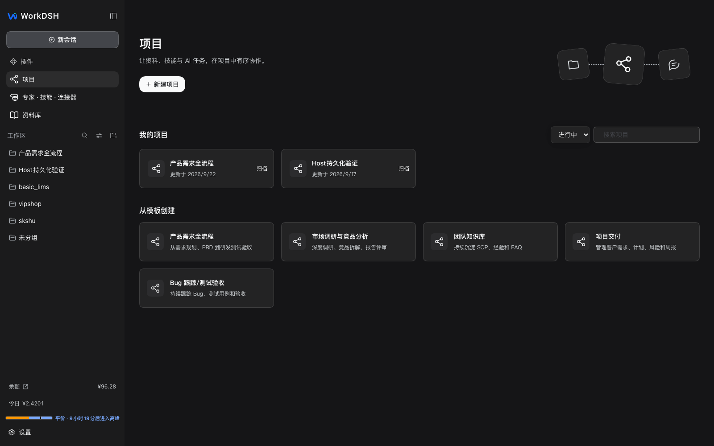
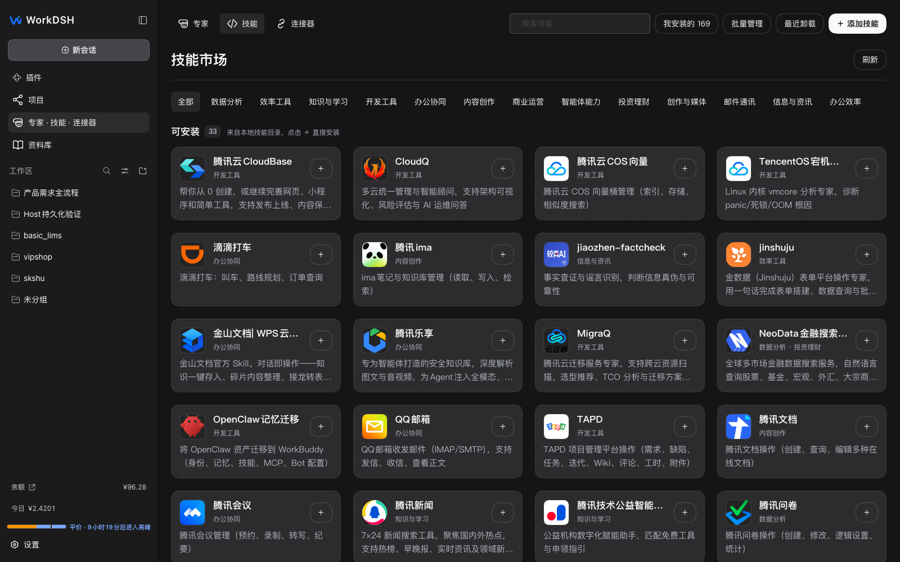

<p align="center"></p>
<h1 align="center">WorkDSH</h1>
<p align="center"><strong>WorkBuddy 式工作台，连接 DSH 插件生态。</strong></p>
<p align="center">以 WorkBuddy 为蓝本，把项目、资料、专家、技能和连接器带到桌面；用 DeepSeek Harness 插件扩展工作能力。</p>
<p align="center"><a href="#下载桌面版">下载桌面版</a> · <a href="#从资料到成果">了解工作流</a> · <a href="docs/user-guide.md">使用指南</a> · <a href="README.md">English</a></p>

[](https://github.com/techflag/workdsh/releases/tag/desktop-v2.0.5-alpha.21) [](https://github.com/techflag/workdsh) [](LICENSE)



<sub>WorkDSH 本地运行截图。项目名称和账户数值为演示环境数据，不随安装包提供。</sub>

## WorkBuddy 式体验，DSH 开放生态

WorkDSH 以 WorkBuddy 的工作方式为蓝本，复刻从项目组织、资料引用到专家和技能协作的核心路径。它同时保留 DeepSeek Harness 的模型、工具和会话能力，让熟悉的桌面工作台可以继续通过 DSH 插件扩展。

| 你要完成的事 | WorkDSH 提供的入口 |
| --- | --- |
| 围绕长期目标持续工作 | **项目**集中管理指令、计划、任务、资料和能力配置。 |
| 让 AI 用上已有文件 | **资料库**管理本地文件、搜索和预览，任务可引用资料及其修订。 |
| 复用团队擅长的方法 | **专家**保存角色与能力配置；**技能**承载可调用的说明和资源。 |
| 把结果带出对话 | **成果工作区**预览或编辑支持的文档、表格、演示文稿、HTML 和 PDF 工作副本。 |

### 从资料到成果

```text
资料库中的文件 ──引用──> 项目任务 ──选择──> 专家 / Skill / 连接器
                                      │
                                      └──> 查看过程与成果，在支持的编辑器中继续修改
```

这条路径是 WorkDSH 的产品方向。项目内资料引用、专家执行与不同 Office 格式的完整端到端体验仍在 Alpha 验收中；各格式的预览、编辑和导出范围不同，[当前能力与限制](workdsh-web/README.zh-CN.md)有更具体的说明。

<details>
<summary>查看实际会话中的 HTML 成果示例</summary>


<sub>本地任务示例；展示成果卡片和右侧预览，不代表任意文件都能无损编辑。</sub>

</details>

## 面向 WorkBuddy Skill，接入 DSH 插件

这是 WorkDSH 的另一半特色：**工作方式参考 WorkBuddy，能力扩展沿用 DSH**。两种生态承担不同的角色：

| | WorkBuddy 风格 Skill | DSH 插件 |
| --- | --- | --- |
| 带来什么 | 可复用的工作说明、脚本、参考资料和资源 | 新的工具、服务与工作台能力 |
| 如何使用 | 导入包含 `SKILL.md` 的文件或 ZIP，预检后确认安装 | 按当前 DSH 版本加载和组合插件 |
| 在 WorkDSH 中 | 本地技能目录可搜索、启停和管理；可迁入 WorkBuddy 风格及社区 Skill | 项目、资料库、专家、技能、连接器本身也是扩展能力，并可适配第三方插件 |

WorkBuddy 风格的 Skill 来源广泛，WorkDSH 提供兼容的导入入口，**不把“可导入”说成“全部已验证或预装”**。含脚本、外部服务或特殊依赖的 Skill 要逐个测试；第三方 DSH 插件也需按当前版本验证。[技能管理](workdsh-web/packages/plugins/skills/README.md) · [插件开发](docs/plugin-development.md) · [生态倡议](docs/plugin-ecosystem.md)



<sub>截图中的可安装条目来自演示机的本地技能目录，不代表安装包自带或官方托管的在线市场。</sub>

## 下载桌面版

当前公开桌面安装包为 **2.0.5-alpha.21**。以下链接直接指向 [GitHub Release](https://github.com/techflag/workdsh/releases/tag/desktop-v2.0.5-alpha.21) 中的文件：

| 平台 | 下载 |
| --- | --- |
| Windows x64 | [WorkDSH Setup.exe](https://github.com/techflag/workdsh/releases/download/desktop-v2.0.5-alpha.21/dsh-plugin-desktop-windows-x64--WorkDSH-2.0.5-x64-Setup.exe) |
| macOS Apple Silicon | [WorkDSH arm64.dmg](https://github.com/techflag/workdsh/releases/download/desktop-v2.0.5-alpha.21/dsh-plugin-desktop-macos-arm64--WorkDSH-2.0.5-arm64.dmg) |
| macOS Intel | [WorkDSH x64.dmg](https://github.com/techflag/workdsh/releases/download/desktop-v2.0.5-alpha.21/dsh-plugin-desktop-macos-x64--WorkDSH-2.0.5-x64.dmg) |

Desktop 安装包默认内置 Node.js 和 Python 运行时，普通用户无需单独安装。当前为 **Alpha 版**：项目资料引用、专家执行及不同 Office 格式的端到端体验仍在验收中。macOS DMG 未签名；更新请从 [Releases](https://github.com/techflag/workdsh/releases) 下载。开始使用前请阅读[用户指南](docs/user-guide.md)和[常见问题](docs/faq.md)。

## 开发与文档

源码分工：[WorkDSH 功能包与 Web](workdsh-web/README.zh-CN.md) · [Desktop 外壳](dsh-plugin-desktop/README.zh.md) · [架构](docs/architecture.md) · [全部文档](docs/README.md)。从源码运行需要 Node.js 22.19+ 或 24+、Corepack 和 Yarn 4.18.0：

```sh
git submodule update --init --recursive
corepack yarn install --immutable
corepack yarn dev
```

运行检查：`corepack yarn check`。[参与贡献](CONTRIBUTING.md)

## 社区与致谢

WorkDSH 基于开源项目 [DeepSeek Harness](https://github.com/deepseek-ai/deepseek-harness) 构建。反馈与参与：[GitHub Issues](https://github.com/techflag/workdsh/issues) · [参与贡献](CONTRIBUTING.md)

WorkDSH 采用 [MIT License](LICENSE)，是独立社区项目，与 DeepSeek 或 WorkBuddy 不存在隶属、合作、授权或背书关系。相关名称仅用于说明技术来源、兼容性与设计参考。GitHub Contributors 中的上游贡献者来自继承和同步的提交历史，不表示其参与本仓库维护。

## Star 趋势

[](https://www.star-history.com/?repos=techflag%2Fworkdsh&type=date)
