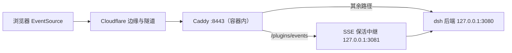

# ADR-0028：SSE 空闲心跳保活中继

状态：Accepted（用户指令「先实施 SSE 心跳保活中继」）。日期：2026-09-18。

## 背景

`https://dsh.10ge.cn/plugins/events` 是官方 dsh 提供的 SSE 端点：握手后先发一帧插件图（实测约 30 KB），随后长期静默。办公出口路径会在 ~120—127 秒把这条空闲流静默清除，Cloudflare 边缘随即以 `canceled by remote with error code 0` 取消隧道侧对应流，浏览器 `EventSource` 断开并自动重连。定位过程与排除法证据见 [STATUS](../STATUS.md) 的「定位控制台 SSE 告警」一节。

这条流不承担业务正确性（会话、生成、写入链路均已另行实测通过），但每 ~2 分钟一次的重连持续产生控制台告警，并在重连窗口内让「连接未就绪」告警可见。端点本身、隧道与容器均已排除，唯一有效的修法是**让这条流不再空闲**。

## 拟采用方案

在 dsh 后端（`127.0.0.1:3080`）与容器内 Caddy（`:8443`）之间插入一个只做保活的同容器中继：

- 中继**只**位于 `/plugins/events` 这一条路由上；其余路径的链路不变。
- 中继转发请求时**移除 `Accept-Encoding`**，保证上游 SSE 不被压缩，从而可以把 `: keepalive` 注释行安全插入明文流；对客户端的压缩仍由 Caddy 按客户端能力统一处理。
- 空闲超过 25 秒写一行 SSE 注释（`: keepalive`）并持续续期；上游一有新数据即重置计时。
- 只注入注释行：不改状态帧、不介入会话、不缓存、不重写响应体语义、不产生任何日志或数据。
- 部署形态沿用既有的「派生副本 + 只读挂载」做法（与取消 Basic Auth、启动期崩溃兜底同一套）：中继脚本、派生 Caddyfile、派生 entrypoint 都是镜像外的宿主机文件，**不改镜像、不改上游包**。

## 权衡与失败边界

- 增加一跳本地转发。若中继不可用，影响面限于 `/plugins/events`（Caddy 返回 502、客户端继续重连），行为不劣于现状。
- 心跳的间隔与长度是针对该出口路径的经验值，不是协议保证。若出口设备按其他特征（例如字节总量或连接生命周期）清理，保活可能无效——以实测存活时间判定，不以推理判定。
- 派生副本与镜像版本耦合：镜像升级后官方 Caddyfile / entrypoint 若有变更，副本会静默过期（此坑已有记录），升级前后必须比对。
- 中继是**部署侧兜底**，不是上游修复。上游若在 `/plugins/events` 自行发送心跳，本中继应撤除。

## 范围

仅覆盖 `/plugins/events` 一条流。不改上游 dsh、不改官方客户端、不改 Cloudflare 隧道配置、不新增对外入口、不改变任何鉴权与授权行为。心跳与业务无关，不进入 Harness 日志、不写入任何业务数据。
