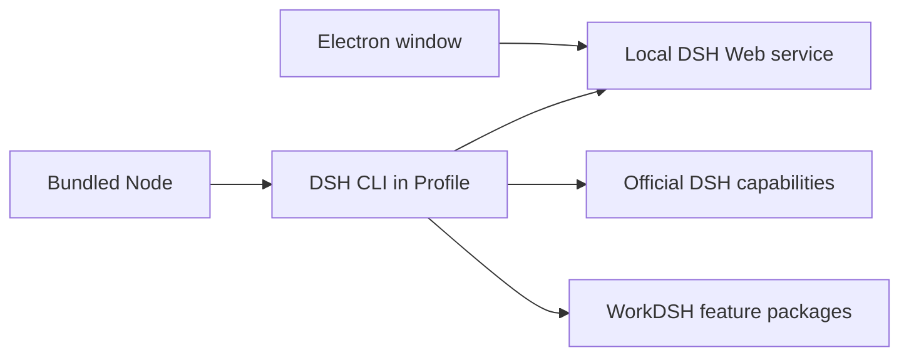

# WorkDSH Desktop architecture

[中文](architecture.md)

WorkDSH Desktop is an Electron carrier for one pinned DeepSeek Harness Profile. `dsh-plugin-desktop/src/workdsh-main.ts` is the installer's only application entry point. `deepseek-harness/` is an unmodified upstream submodule. The bundled `workdsh-runtime/profiles/workdsh` provides the DSH Host, Web UI, and WorkDSH feature packages.

At launch, Electron materializes the Profile under application data, links its dependencies, and starts `dsh --profile workdsh --no-open` with bundled Node. Once DSH is ready, the window loads its local token URL. Closing the Windows window exits and stops the child process; macOS follows its normal window lifecycle. The current carrier does not implement the former tray, mode switcher, multi-Profile selector, or automatic update manager.

Projects, library, experts, skills, and connectors are composed by `workdsh-bundle`. Activity and Office support these product surfaces; audit, access, local identity, and browser session are internal Profile services. None is a second Desktop or a second DSH installation inside Electron. Community Market and Fabric currently remain design documentation and do not run in installers.

`upstream.json` records the sole upstream commit and version. The carrier has no direct DSH npm dependency. Packaging scripts use that version to prepare and verify the Profile, official primary runtime, and installer. The installed `app.asar` contains only the Electron entry point, without a second `node_modules`. An upgrade updates the upstream pin, compatible WorkDSH Profile, and bundled resources, then runs `corepack yarn check`, platform packaging checks, and installed-app startup validation. The default target is the latest official stable release; pre-releases require an explicit decision.

See [ownership boundaries](desktop-boundaries.md) and the [package build guide](../dsh-plugin-desktop/README.md).
