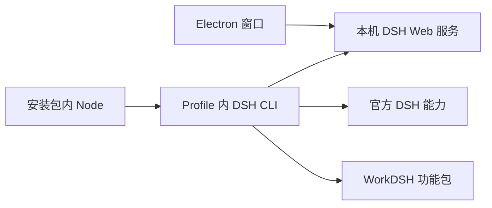

# WorkDSH Desktop 架构

[English](architecture.en.md)

WorkDSH Desktop 是一个 Electron 外壳，运行一套固定版本的 DeepSeek Harness Profile。`dsh-plugin-desktop/src/workdsh-main.ts` 是安装包唯一的应用入口；`deepseek-harness/` 是不修改的上游子模块。安装包中的 `workdsh-runtime/profiles/workdsh` 提供 DSH Host、Web UI 和 WorkDSH 功能包。

启动时，Electron 将 Profile 复制到应用数据目录并链接其依赖，使用安装包内的 Node 启动 `dsh --profile workdsh --no-open`。DSH 就绪后，窗口加载服务输出的本机 token URL。关闭 Windows 窗口会退出并终止子进程；macOS 遵循系统窗口生命周期。当前外壳没有旧版的托盘、模式切换、多 Profile 选择或自动更新管理器。

WorkDSH 的项目、资料库、专家、技能、连接器通过 `workdsh-bundle` 组合。活动记录和 Office 支撑这些产品界面；审计、访问控制与本地身份、浏览器会话是 Profile 内部服务。它们都不是第二个 Desktop，也不在 Electron 外壳内另装一套 DSH。市场与 Fabric 目前只保留设计文档，不随安装包运行。

`upstream.json` 记录唯一的上游提交和版本。外壳不直接依赖 DSH npm 包。打包脚本读取该版本来准备和验证 Profile、官方主运行时与安装包；安装后的 `app.asar` 只含 Electron 入口，不含第二个 `node_modules`。升级时依次更新上游固定提交、WorkDSH Profile 兼容版本和打包资源，并通过 `corepack yarn check`、平台打包检查及安装包启动验证。默认采用上游最新正式版，预发布版本需要明确选择。

参见[归属约束](desktop-boundaries.md)与[包级构建说明](../dsh-plugin-desktop/README.zh.md)。
