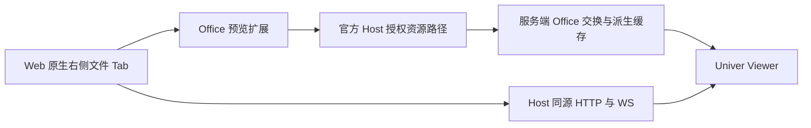

# ADR-0021：服务端 Office 转换与原生右侧预览桥接

状态：Rejected（用户明确禁止服务端转换；后续验证纯浏览器编辑）。日期：2026-09-12。

## 背景

用户要求 Excel/PPT/Word 产物直接预览，客户端不使用本机 Office 转换，并提出 dsh-univer-office。独立安装发现发布版本 0.2.14 的 peer 范围不覆盖当前 Harness；其默认 Viewer 使用 Host loopback。详见 [调查证据](../evidence/univer-office-compatibility.md)。

## 拟采用方案

优先复用第三方插件的 Office 交换和 Viewer，通过适配版本解决公开 API 兼容，并以独立预览插件接入 Harness 原生文件面板。Viewer 与资源走受授权的 Host 同源路由，转换只生成派生缓存，查看不修改原件。不另建 Loader、模型调用链或文件 Tab 所有者。

## 权衡与失败边界

复用插件减少 Office 交换实现，但需维护第三方适配及原生依赖部署，且不能承诺全格式保真。先确认公开转换契约再实现桥接，不直接消费未导出私有服务。转换超时、权限失败和格式不支持必须有可见提示、原件下载和缓存清理。外部浏览器验收不通过则不能交付服务器＋Web 预览。

## 范围

本 ADR 为接入提案，尚未实现或宣布插件兼容。固定 Harness 版本不变；不提前开发企业管理后台，不更改单专家发布范围。
